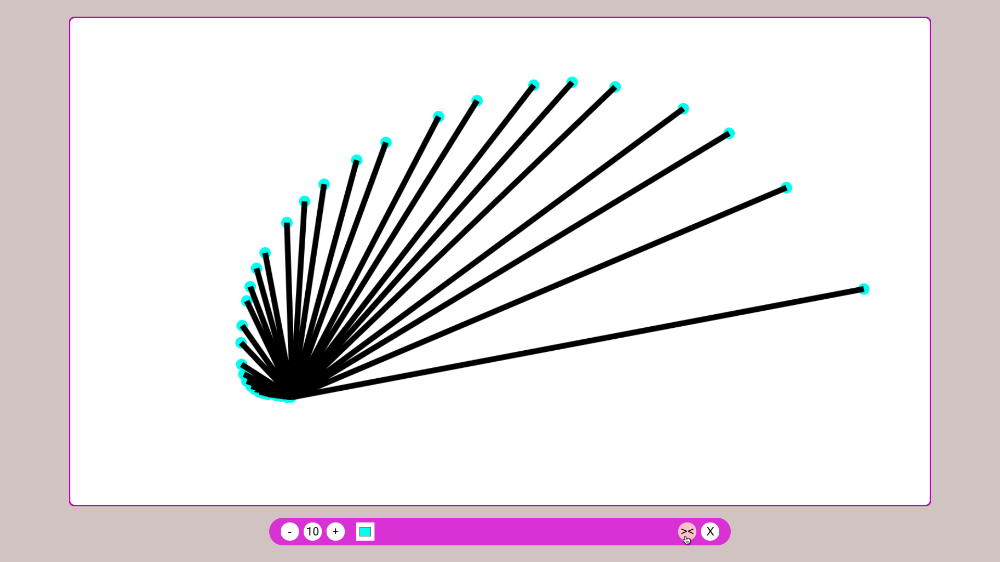

## A Simple Paint Application, with creative extras :))
- [LIVE (click to try)](https://divyanshsood00.github.io/jspaint/)

### Top Toolbar(in order of placement)
- Upload Button =>
    - Restore the .bkp file and redraws on canvas.
- Screenshot Button =>
    - Download Png image of the painting canvas.
- Download Button =>
    - Download .bkp file for editing the drawing in future.

### Lower Toolbar(in no particular order)
- Click on the button with lollypop =>
    - gives you cool colourful spirals.
    - It was a bug that I has implemented as a feature.
- Click on pencil =>
    - Rough marker like texture
- Click on highlighter =>
    - Simple marker
- Undo/Redo Feature =>
    - Stacks for basic undo and redo fectures.
- Click on Eraser => 
    - Erases, brush size setting works with it.
- Refresh Safe =>
    - Autosaves every 15 seconds to localstorage.
    - Might have issues with eraser, undo functionalities.(atleast till I put on next revision)
- Rest, is a basic paint application, with brush size, colour and clear option.

<!--  -->
#### Let me know if you find any bugs (touchscreen supported, might have issues).
#### Made in live with JS.   